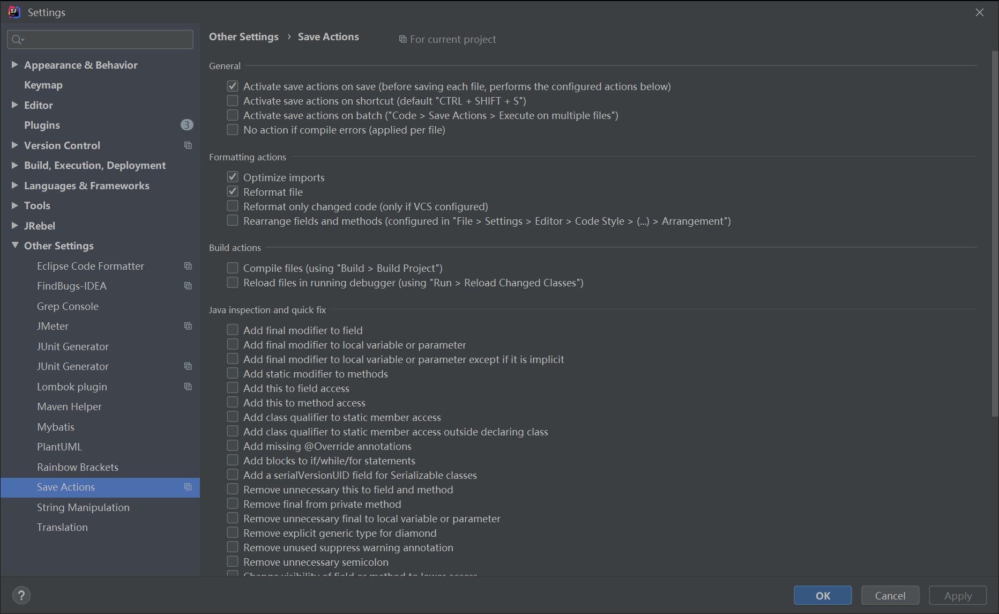

# IDEA配置阿里P3C代码格式化文件及IDEA开发小技巧
   - 由于阿里巴巴P3C的格式化配置文件是基于eclipse的，如果需要在IDEA上使用，则需要安装`Eclipse Code Formatter`插件
## 一. 配置阿里P3C代码格式化
   - 1.安装`Eclipse Code Formatter`插件
     - 安装方式一：离线安装
        - 官方下载地址：https://plugins.jetbrains.com/plugin/6546-eclipse-code-formatter/versions
        - 个人仓库下载地址： https://image-show.oss-cn-shenzhen.aliyuncs.com/p3c/EclipseFormatter.zip
       > 下载后IDEA打开 File -> settings -> Plugins
      
      选择你下载的`EclipseFormatter.zip`文件进行安装
     
     - 安装方式二：在线安装
        > IDEA打开 File -> settings -> Plugins
        
        安装重启即可
   
   - 2.导入P3C格式化配置文件`eclipse-codestyle.xml`
     - 下载地址：
       - 官方git下载：https://github.com/alibaba/p3c/blob/master/p3c-formatter/eclipse-codestyle.xml
       - 个人仓库下载：https://image-show.oss-cn-shenzhen.aliyuncs.com/p3c/eclipse-codestyle.xml
      - 导入步骤 IDEA打开File -> settings -> OtherSettings
      
  
## 二.  自动格式化并优化导包
   - 安装`Save Actions`插件
   - 配置如下
   
   
## 三. 新建类自动添加类注解
   - IDEA打开File -> settings -> Editor -> File and Code Templates
   
   - 文本如下
        ```
        /**
        * 应用模块名称<p>
        * 代码描述<p>
        * Copyright: Copyright (C) ${YEAR} XXX, Inc. All rights reserved. <p>
        * Company: XXX科技有限公司<p>
        * @author  ${USER}
        * @since ${DATE} ${TIME} 
        */
        ```
   - 效果图
   
## 四. 快速添加方法注释
   - 1.IDEA打开File -> settings -> Editor -> Live Templates
   - 2.又上角`+`添加一个组和一个新建一个模板
      - By default expand with为快捷键选项，下图快捷键为`tab`
      - Abbreviation内容为模板名，`/ + 模板名(a) + 快捷键(tab)` 触发填充
      - Description内容为注释，可以忽略。
   - 
   - 3.添加模板内容
   
       ```
        **
         *
         * @author show
         * @date $time$ $date$       
         * @param $param$
         * @return $return$
         */
       ```
   - 4.设置参数的获取方式
        - Edit Variables 可以设置参数的获取方式
        
   - 5.设置模板的应用范围
   
   - 6.效果演示
     - 在方法头填入`/a`这时会有智能提示，这时按`Enter(回车)`或者`Tab(换行)`即可自动填入注释模板
   
   
   
