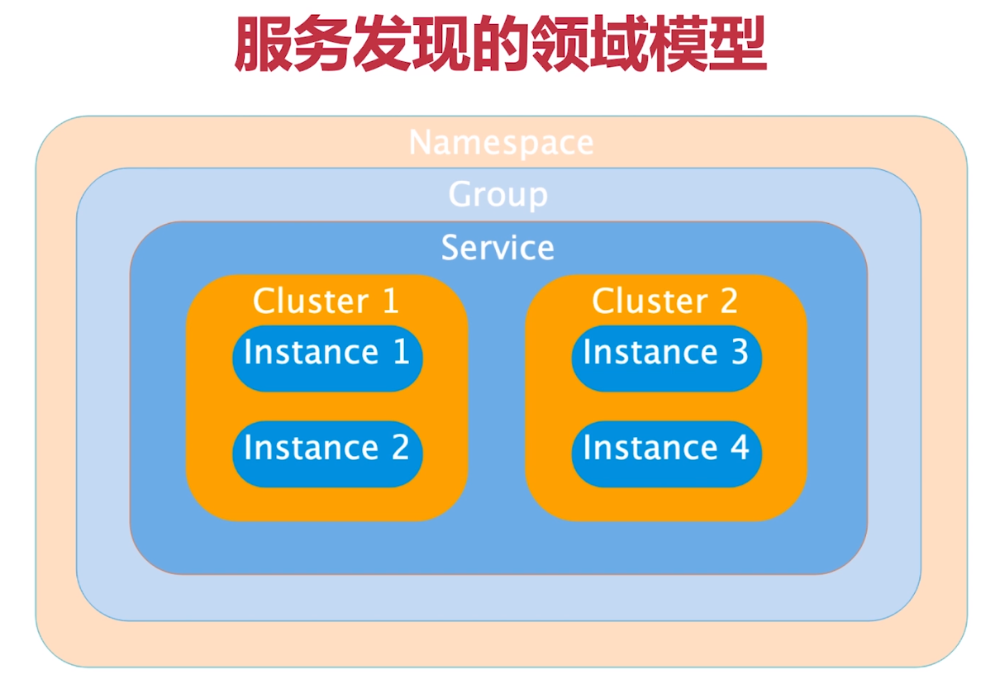

## 服务提供者与服务消费者
  - 服务提供者(Server)：服务的被调用者(为其他微服务体用接口的微服务)
  - 服务消费者(Client)：服务的调用方(调用其他微服务接口的微服务)
  
## 什么是Nacos?
  - [Nacos官网](https://nacos.io/zh-cn/docs/what-is-nacos.html)
  - 服务（Service）是 Nacos 世界的一等公民。Nacos 支持几乎所有主流类型的“服务”的发现、配置和管理：
    - Kubernetes Service
    - gRPC & Dubbo RPC Service
    - Spring Cloud RESTful Service
  - Nacos 的关键特性包括:
    - **服务发现和服务健康监测**
      - Nacos 支持基于 DNS 和基于 RPC 的服务发现。服务提供者使用 原生SDK、OpenAPI、或一个独立的Agent TODO注册 Service 后，服务消费者可以使用DNS TODO 或HTTP&API查找和发现服务。
        
        Nacos 提供对服务的实时的健康检查，阻止向不健康的主机或服务实例发送请求。Nacos 支持传输层 (PING 或 TCP)和应用层 (如 HTTP、MySQL、用户自定义）的健康检查。 对于复杂的云环境和网络拓扑环境中（如 VPC、边缘网络等）服务的健康检查，Nacos 提供了 agent 上报模式和服务端主动检测2种健康检查模式。Nacos 还提供了统一的健康检查仪表盘，帮助您根据健康状态管理服务的可用性及流量。
    - **动态配置服务**
      - 动态配置服务可以让您以中心化、外部化和动态化的方式管理所有环境的应用配置和服务配置。
        
        动态配置消除了配置变更时重新部署应用和服务的需要，让配置管理变得更加高效和敏捷。
        
        配置中心化管理让实现无状态服务变得更简单，让服务按需弹性扩展变得更容易。
        
        Nacos 提供了一个简洁易用的UI (控制台样例 Demo) 帮助您管理所有的服务和应用的配置。Nacos 还提供包括配置版本跟踪、金丝雀发布、一键回滚配置以及客户端配置更新状态跟踪在内的一系列开箱即用的配置管理特性，帮助您更安全地在生产环境中管理配置变更和降低配置变更带来的风险。
    - **动态 DNS 服务** 
      - 动态 DNS 服务支持权重路由，让您更容易地实现中间层负载均衡、更灵活的路由策略、流量控制以及数据中心内网的简单DNS解析服务。动态DNS服务还能让您更容易地实现以 DNS 协议为基础的服务发现，以帮助您消除耦合到厂商私有服务发现 API 上的风险。
        
        Nacos 提供了一些简单的 DNS APIs TODO 帮助您管理服务的关联域名和可用的 IP:PORT 列表.
    - **服务及其元数据管理**
      - Nacos 能让您从微服务平台建设的视角管理数据中心的所有服务及元数据，包括管理服务的描述、生命周期、服务的静态依赖分析、服务的健康状态、服务的流量管理、路由及安全策略、服务的 SLA 以及最首要的 metrics 统计数据。
    - **......**
  - Nacos 地图
    
    - 特性大图：要从功能特性，非功能特性，全面介绍我们要解的问题域的特性诉求
    - 架构大图：通过清晰架构，让您快速进入 Nacos 世界
    - 业务大图：利用当前特性可以支持的业务场景，及其最佳实践
    - 生态大图：系统梳理 Nacos 和主流技术生态的关系
    - 优势大图：展示 Nacos 核心竞争力
    - 战略大图：要从战略到战术层面讲 Nacos 的宏观优势
  - Nacos 生态图
    
  > 服务发现组件 + 配置服务器
  
## 搭建NacosServer
- 下载NacosServer
   - 下载地址 ：https://github.com/alibaba/nacos/releases
    - 如何查看兼容的nacos版本?
       - 找到你pom导入的 spring-cloud-alibaba-dependencies
       ```xml
          <!--整合Spring Cloud alibaba-->
          <dependency>
              <groupId>org.springframework.cloud</groupId>
              <artifactId>spring-cloud-alibaba-dependencies</artifactId>
              <version>0.9.0.RELEASE</version>
              <type>pom</type>
              <scope>import</scope>
          </dependency>
       ```
       - 点击进去 在<properties> 里面即可看到nacos版本
       ```xml
         <nacos.client.version>1.0.0</nacos.client.version>
       ```
- 搭建NacosServer
  - 参考文档：https://nacos.io/zh-cn/docs/quick-start.html 
  - 启动服务器
    - Linux/Unix/Mac
      启动命令(standalone代表着单机模式运行，非集群模式):
      ```
      sh startup.sh -m standalone
      ```
    - Windows
      启动命令：
      ```
      cmd startup.cmd
      ```
      或者双击startup.cmd运行文件。
  - 打开网页 http://localhost:8848/nacos/index.html#/login
  - 账号密码:nacos/nacos 
  - 进入控制台
  
## 将应用注册到Nacos
> SpringCloud 项目命名规律：spring-cloud-starter-{Spring Cloud子项目的名称}-[{模块名称}] 
  - spring-cloud-starter-alibaba-dependencies
  - spring-cloud-starter-openfeign 
1. 添加依赖
```xml
 <dependency>
      <groupId>org.springframework.cloud</groupId>
      <artifactId>spring-cloud-starter-alibaba-nacos-discovery</artifactId>
  </dependency>
```
2. 加注解(非必须) @EnableDiscoveryClient
3. 加配置
```
spring.cloud.nacos.config.server-addr=127.0.0.1:8848
spring.application.name=example
```

## 服务发现的领域模型

- Namespace：实现隔离，默认public
- Group：不同服务可以分到一个组，默认DEFAULT_GROUP
- Service：微服务
- Cluster：对指定微服务的一个虚拟划分，默认DEFAULT
- Instance：微服务实例

## 元数据
- 什么是元数据？
  - 官方描述：Nacos数据（如配置和服务）描述信息，如服务版本、权重、容灾策略、负载均衡策略、鉴权配置、各种自定义标签 (label)，从作用范围来看，分为服务级别的元信息、集群的元信息及实例的元信息。
  - 级别：【~~服务级别~~、~~集群级别~~、实例级别】
- 元数据作用
  - 提供描述信息
  - 让微服务调用更加灵活 
    - 例如微服务版本控制
- 如何为微服务设置元数据
  - 控制台设置    
  - 配置文件指定
   ```yaml
    spring:
      cloud:
        nacos:
          discovery:
            #元数据设置
            metadata:
              instance: c
              haha: hehe
              version: v1
  ```  