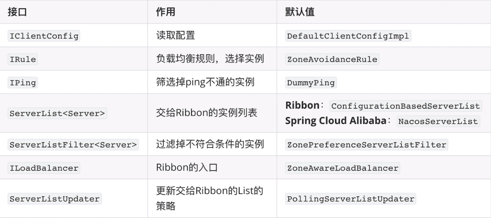
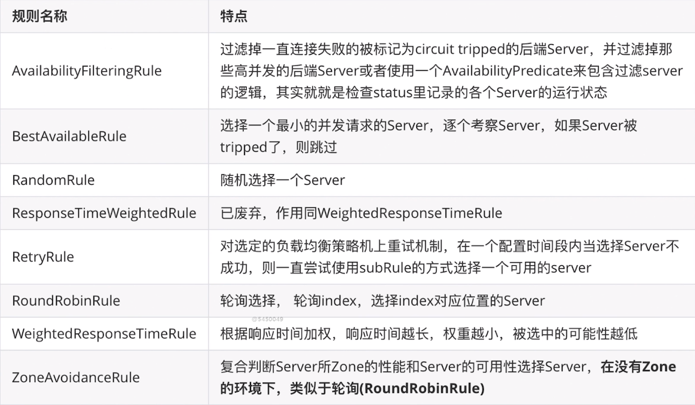
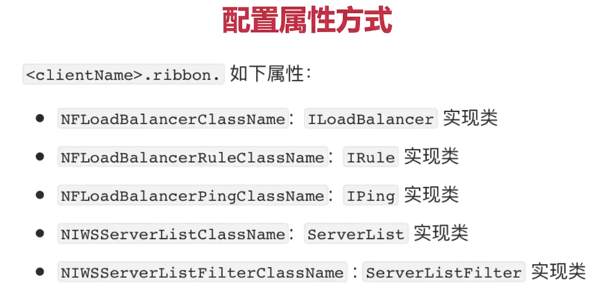
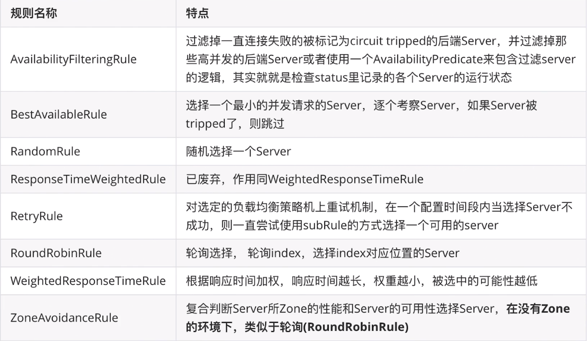

# 4-实现负载均衡-Ribbon
## 负载均衡的两种方式
- 服务器端负载均衡
  - nginx
- 客户端侧负载均衡
  - ribbon
## 使用Ribbon实现负载均衡
- Ribbon是什么？  
  - Netflix开源的客户端侧负载均衡器
- Ribbon组成

- Ribbon内置的负载均衡规则



----
## 支持的配置项

## 饥饿加载
- ribbon会在首次访问的时候，才会加载类，所以首次调用其他微服务请求，会比较慢，我们可以通过开启饥饿加载解决
  ```yaml
  ribbon:
    eager-load:
      enabled: true #开启饥饿加载
      clients: user #为那个服务开启 
  ```
## 扩展Ribbon

 - 支持Nacos权重
   ```java
    @Slf4j
    public class NacosWeightedRule extends AbstractLoadBalancerRule {
  
      @Autowired
      private NacosDiscoveryProperties nacosDiscoveryProperties;
  
      @Override
      public void initWithNiwsConfig(IClientConfig clientConfig) {
          // 读取配置文件，并初始化 NacosWeightedRule，该方法一般为空
      }
  
      @Override
      public Server choose(Object key) {
          try {
              BaseLoadBalancer loadBalancer = (BaseLoadBalancer) this.getLoadBalancer();
              log.info("lb = {}", loadBalancer);
              // 想要请求的微服务的名称
              String name = loadBalancer.getName();
              // 实现负载均衡算法。。
              // 拿到服务发现的相关API
              NamingService namingService = nacosDiscoveryProperties.namingServiceInstance();
              // nacos client自动通过基于权重的负载均衡算法，给我们选择一个实例。
              Instance instance = namingService.selectOneHealthyInstance(name);
              log.info("选择的实例是：port = {}, instance = {}", instance.getPort(), instance);
              return new NacosServer(instance);
          } catch (NacosException e) {
              return null;
          }
        }
      }
      // Spirng Cloud Commons --> 定义了标准
      // Spring Cloud loadbalancer --> 没有权重
    ```
   ```java
    /**
     * 自定义Ribbon负载均衡规则
     * @author xuanweiyao
     * @date 10:11 2019/7/11
     */
    @Configuration
    public class RibbonConfiguration {
        /**
         * 使用 Nacos Client 的负载均衡算法
         * @author xuanweiyao
         * @date 10:10 2019/7/11
         * @return com.netflix.loadbalancer.IRule
         */
        @Bean
        public IRule ribbonRule() {
    
            return new NacosWeightedRule();
        }
    }
    ```
- 统一集群优先调用
  ```java
  /**
   * 同一集群优先调用
   *
   * @author xuanweiyao
   * @date 11:07 2019/7/11
   */
  @Slf4j
  public class NacosSameClusterWeightedRule extends AbstractLoadBalancerRule {
    @Autowired private NacosDiscoveryProperties nacosDiscoveryProperties;
  
    @Override
    public void initWithNiwsConfig(IClientConfig clientConfig) {}
    /**
     * 1. 找到指定服务的所有实例 A<br>
     * 2. 过滤出相同集群下的所有实例 B<br>
     * 3. 如果B是空，就用A<br>
     * 4. 基于权重的负载均衡算法，返回一个实例<br>
     *
     * @author xuanweiyao
     * @date 11:08 2019/7/11
     * @return com.netflix.loadbalancer.Server
     */
    @Override
    public Server choose(Object key) {
      try {
        // 拿到配置文件中集群名称 NJ
        //  spring.cloud.nacos.discovery.cluster-name: NJ
        String clusterName = nacosDiscoveryProperties.getClusterName();
        BaseLoadBalancer loadBalancer = (BaseLoadBalancer) this.getLoadBalancer();
        log.info("lb = {}", loadBalancer);
        // 想要请求的微服务的名称
        String name = loadBalancer.getName();
        // 拿到服务发现的相关API
        NamingService namingService = nacosDiscoveryProperties.namingServiceInstance();
        // 1. 找到指定服务的所有实例 A<br> turn :只拿健康的实例
        List<Instance> instances = namingService.selectInstances(name, true);
        // 2. 过滤出相同集群下的所有实例 B<br>
        List<Instance> sameClusterInstances =
            instances.stream()
                .filter(instance -> Objects.equals(instance.getClusterName(), clusterName))
                .collect(Collectors.toList());
        // 3. 如果B是空，就用A<br>
        List<Instance> instancesToBeChosen = new ArrayList<>();
        if (sameClusterInstances.isEmpty()) {
          instancesToBeChosen = instances;
          log.warn(
              "发现跨集群的调用， name = {}，clusterName = {}, instances = {}", name, clusterName, instances);
        } else {
          instancesToBeChosen = sameClusterInstances;
        }
        // 4. 基于权重的负载均衡算法，返回一个实例<br>
        Instance instance = ExtendBalancer.getHostByRandomWeight2(instancesToBeChosen);
        log.info("选择的实例是 port = {}， instance = {}", instance.getPort(), instance);
        return new NacosServer(instance);
      } catch (NacosException e) {
        log.error("发生异常了", e);
        return null;
      }
    }
  }
  /**
   * 因为nacos暂时没有api是可以实现自己传入instances进行权重分配<br>
   * 所以我们可以追踪 namingService.selectOneHealthyInstance() 源码查看底层如何进行权重分配<br>
   * 源码的方法是 protected 权限的，我们可以新建一个类继承它的父类实现调用。<br>
   * 源码地址：com.alibaba.nacos.client.naming.core.Balancer#getHostByRandomWeight(java.util.List)<br>
   *
   * @author xuanweiyao
   * @date 11:40 2019/7/11
   */
  class ExtendBalancer extends Balancer {
    static Instance getHostByRandomWeight2(List<Instance> hosts) {
  
      return getHostByRandomWeight(hosts);
    }
  }
  ```
  ```java
  @Configuration
  public class RibbonConfiguration {
    /**
     * 使用自定义的负载均衡算法
     *
     * @author xuanweiyao
     * @date 10:10 2019/7/11
     * @return com.netflix.loadbalancer.IRule
     */
    @Bean
    public IRule ribbonRule() {
      return new NacosSameClusterWeightedRule();
    }
  }
  ```
- 基于元数据的版本控制
  ```yaml
  spring:
    cloud:
      nacos:
          metadata: 
            # 自己这个实例的版本
            version: v1
            # 允许调用的提供者版本
            target-version: v1
  ```
  ```java
  @Slf4j
  public class NacosFinalRule extends AbstractLoadBalancerRule {
      @Autowired
      private NacosDiscoveryProperties nacosDiscoveryProperties;
  
      @Override
      public Server choose(Object key) {
          // 负载均衡规则：优先选择同集群下，符合metadata的实例
          // 如果没有，就选择所有集群下，符合metadata的实例
  
          // 1. 查询所有实例 A
          // 2. 筛选元数据匹配的实例 B
          // 3. 筛选出同cluster下元数据匹配的实例 C
          // 4. 如果C为空，就用B
          // 5. 随机选择实例
          try {
              String clusterName = this.nacosDiscoveryProperties.getClusterName();
              String targetVersion = this.nacosDiscoveryProperties.getMetadata().get("target-version");
  
              DynamicServerListLoadBalancer loadBalancer = (DynamicServerListLoadBalancer) getLoadBalancer();
              String name = loadBalancer.getName();
  
              NamingService namingService = this.nacosDiscoveryProperties.namingServiceInstance();
  
              // 所有实例
              List<Instance> instances = namingService.selectInstances(name, true);
  
              List<Instance> metadataMatchInstances = instances;
              // 如果配置了版本映射，那么只调用元数据匹配的实例
              if (StringUtils.isNotBlank(targetVersion)) {
                  metadataMatchInstances = instances.stream()
                          .filter(instance -> Objects.equals(targetVersion, instance.getMetadata().get("version")))
                          .collect(Collectors.toList());
                  if (CollectionUtils.isEmpty(metadataMatchInstances)) {
                      log.warn("未找到元数据匹配的目标实例！请检查配置。targetVersion = {}, instance = {}", targetVersion, instances);
                      return null;
                  }
              }
  
              List<Instance> clusterMetadataMatchInstances = metadataMatchInstances;
              // 如果配置了集群名称，需筛选同集群下元数据匹配的实例
              if (StringUtils.isNotBlank(clusterName)) {
                  clusterMetadataMatchInstances = metadataMatchInstances.stream()
                          .filter(instance -> Objects.equals(clusterName, instance.getClusterName()))
                          .collect(Collectors.toList());
                  if (CollectionUtils.isEmpty(clusterMetadataMatchInstances)) {
                      clusterMetadataMatchInstances = metadataMatchInstances;
                      log.warn("发生跨集群调用。clusterName = {}, targetVersion = {}, clusterMetadataMatchInstances = {}", clusterName, targetVersion, clusterMetadataMatchInstances);
                  }
              }
  
              Instance instance = ExtendBalancer.getHostByRandomWeight2(clusterMetadataMatchInstances);
              return new NacosServer(instance);
          } catch (Exception e) {
              log.warn("发生异常", e);
              return null;
          }
      }
  
      @Override
      public void initWithNiwsConfig(IClientConfig iClientConfig) {
      }
  }
  ```
  ```java
  public class ExtendBalancer extends Balancer {
      /**
       * 根据权重，随机选择实例
       *
       * @param instances 实例列表
       * @return 选择的实例
       */
      public static Instance getHostByRandomWeight2(List<Instance> instances) {
          return getHostByRandomWeight(instances);
      }
  }
  ```
## 深入理解Nacos的Namespace
