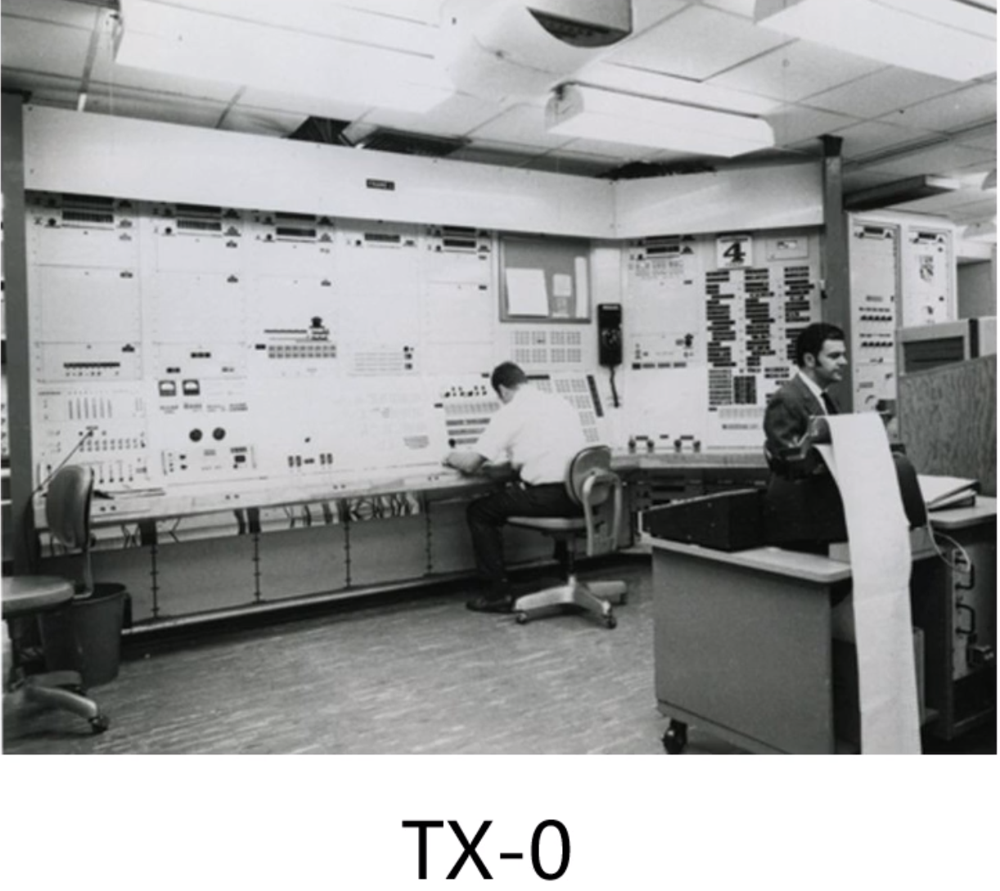

# 计算机学习的发展历史
  - 计算机发展的四个阶段
  - 微型计算机的发展历史
## 计算机发展的四个阶段
- 第一阶段(1946-1957)
  - 电子管计算机
- 第二阶段(1957-1964)
  - 晶体管计算机
- 第三阶段(1964-1980)
  - 集成电路计算机
- 第四阶段(1980-现在)
  - 超大规模集成电路计算机
  

    
###  第一阶段：电子管计算机

- 第二次世界大战是电子管计算机产生的催化剂(**英国为了解密德国海军的密文**)

####  埃尼阿克(ENIAC)
- 产生原因
  - 战争使用了飞机和火箭
  - 打得准则需要计算射击参数
  - 射击参数需要几千次运算才能计算出来
  > **没有计算机前,需要人手算**
- 参数
  - 18000多个电子管
  - 运行耗电量150千瓦
  - 重量达30吨，占地1500平方英尺
- 特点
  - 功耗高，运算速度慢
  - 操作复杂，更换程序需要接线
  - 集成度小，空间占用大
  

###  第二阶段：晶体管计算机
- 产生原因
  - 贝尔实验室的三个科学家发明了晶体管

- 第一台晶体管计算机：来自MIT林肯实验室

- 同时代最高性能的计算机

  - 4k内存，每秒200000指令
  - 配备512*512的显示器
- 特点
  - 集成度相对较高，空间占用相对小
  - 功耗相对较低，运算速度较快
  - 操作相对简单，交互更加方便

## 微型计算机的发展历史
