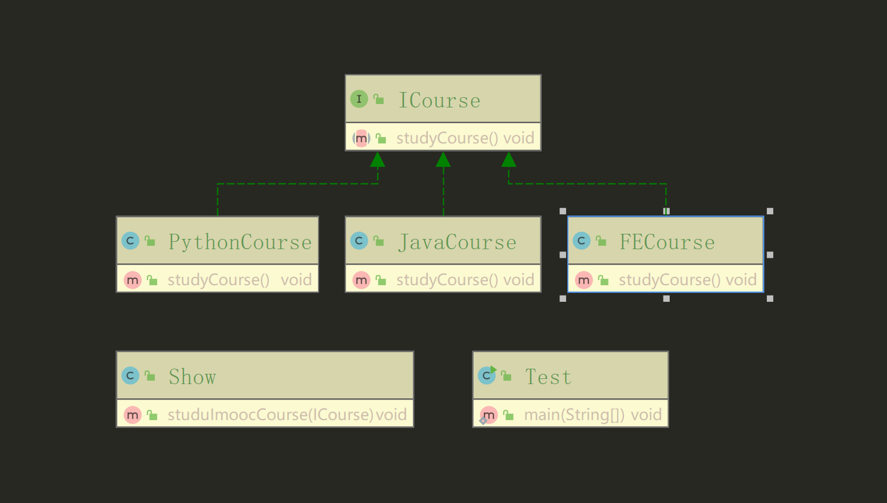

> 高层模块(test)和调用模块(show)是解耦的，调用模块(show)和接口模块(ICourse)是解耦的
- 我们如果有新的逻辑，只需要添加实现类即可
- 而实体类不需要改变
- 只需要使用者在调用的时候插入新的实现类即可
> 在该案例中，对于一个新的课程(功能、模式),我们只需要添加新的实现类并实现课程接口，然后使用者调用时传入新的实现类即可，而不需要修改接口、对象、只需要添加实现类即可。