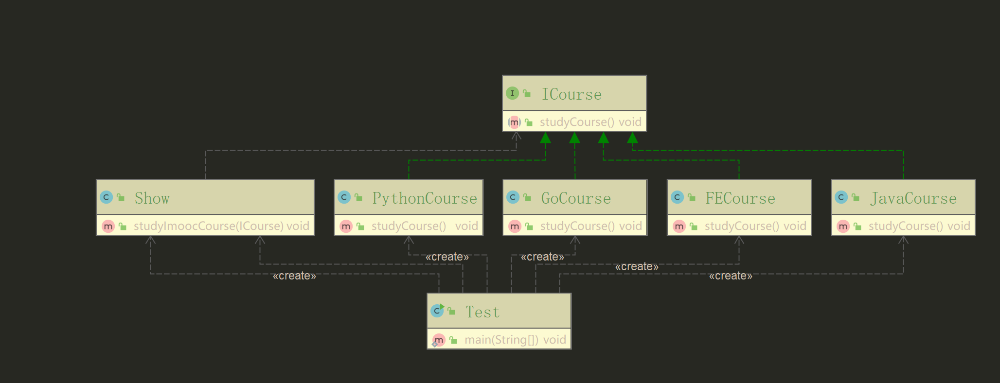
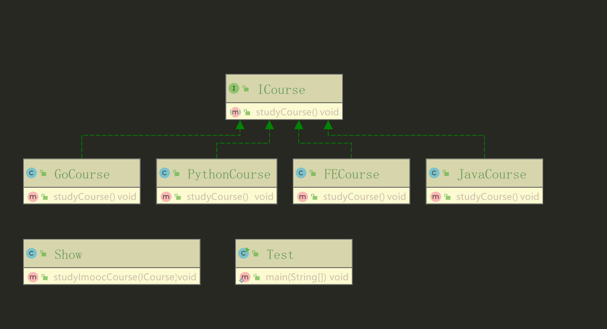

- 我们如果需要学习新的课程，只需要添加新的实现类即可。
- 调用方法的时候,才指定实现类
```java
public class Test {
  /**
   * 依赖倒置原则（接口注入）演示 v2
   *
   * @author xuanweiyao
   * @date 21:19 2019/7/22
   */
  public static void main(String[] args) {
    Show show = new Show();
    show.studyImoocCourse(new JavaCourse());
    show.studyImoocCourse(new PythonCourse());
    show.studyImoocCourse(new FECourse());
    show.studyImoocCourse(new GoCourse());
  }
}
```