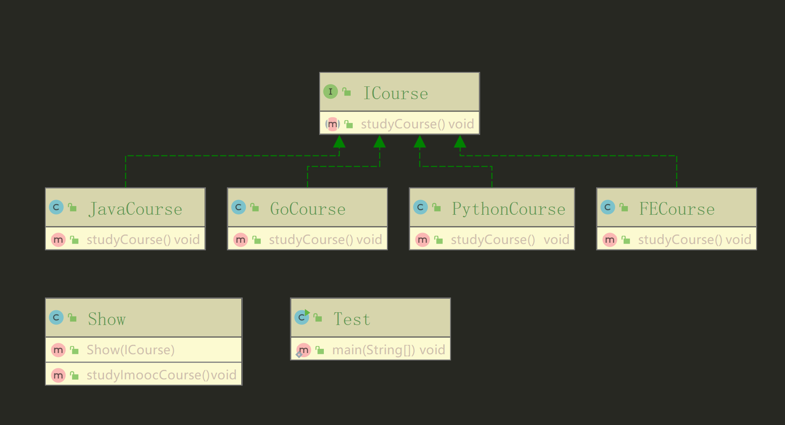

> 这里采用了依赖注入，在实例化类的时候，直接指定实现类。
```java
public class Test {
  /**
   * 依赖倒置原则（依赖注入）演示 v3
   *
   * @author xuanweiyao
   * @date 21:34 2019/7/22
   * @return void
   */
  public static void main(String[] args) {
    Show show1 = new Show(new JavaCourse());
    show1.studyImoocCourse();
    Show show2 = new Show(new PythonCourse());
    show2.studyImoocCourse();
  }
}
```