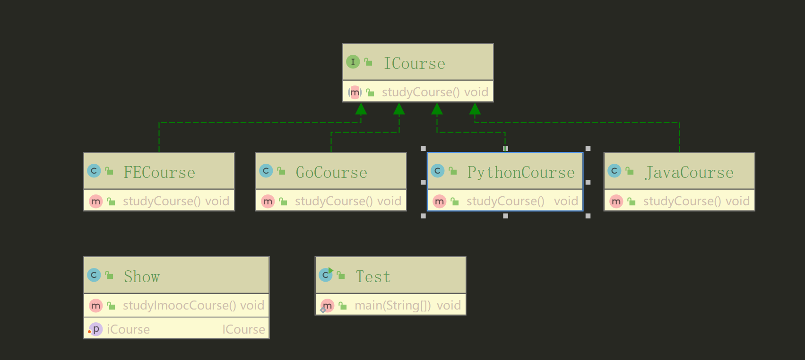

> 这里采用了set注入，在调用方法之前指定实现类
```java
public class Test {
  /**
   * 依赖倒置原则（set注入）演示 v4
   *
   * @author xuanweiyao
   * @date 21:34 2019/7/22
   * @return void
   */
  public static void main(String[] args) {
    Show show = new Show();
    show.setiCourse(new JavaCourse());
    show.studyImoocCourse();
    show.setiCourse(new PythonCourse());
    show.studyImoocCourse();
  }
}
```