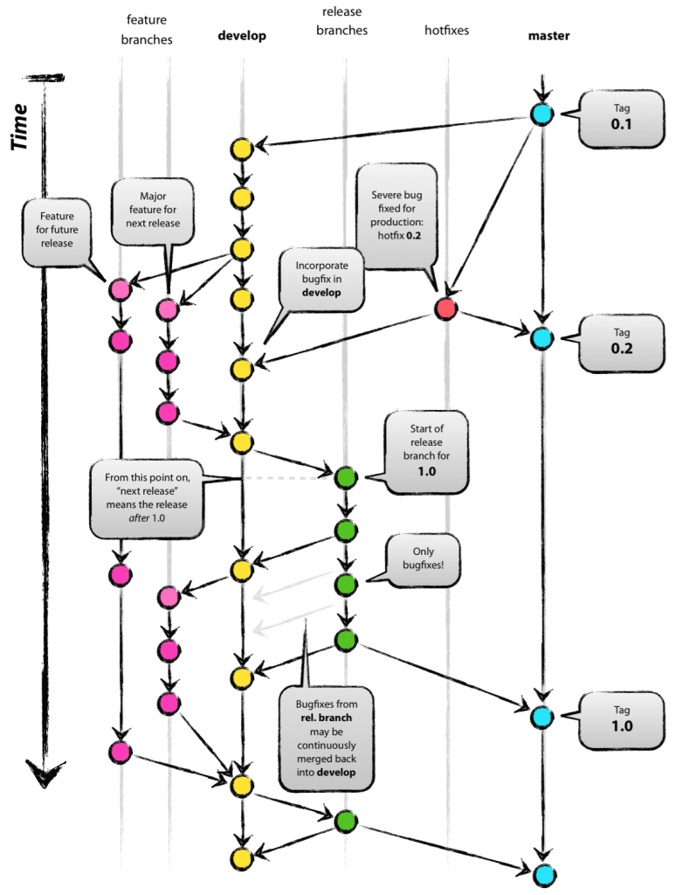

## 什么是Gitflow
- Gitflow是基于Git的强大分支能力所构建的一套软件开发工作流，最早由Vincent Driessen在2010年提出。最有名的大概是下面这张图。

---

### 在Gitflow的模型里，软件开发活动基于不同的分支：
  - **master** 该分支上的代码随时可以部署到生产环境
  - **develop** 作为每日构建的集成分支，到达稳定状态时可以发布并merge回master
  - **Feature branches** 每个新特性都在独立的feature branch上进行开发，并在开发结束后merge回develop
  - **Release branches** 为每次发布准备的release candidate，在这个分支上只进行bug fix，并在完成后merge回master和develop
  - **Hotfix branches** 用于快速修复，在修复完成后merge回master和develop

---

## 新功能开发(登录功能)中，各角色的工作流程
### 前置阶段(新功能启动)
  - 开发组长
    - 基于**master**主干创建一个**develop**分支
  > 现有主干分支: **master**、**develop**
### 开发阶段(开始开发)
  - 程序猿
    - 基于**develop**分支创建一个**feature_login**(语义化)分支
    - 在**feature_login**分支上开发新功能
    - 测试新功能完成以后，在git上发起**Pull request**把代码合并到到**develop**分支上(**千万不要提交合并到master**)
  - 开发组长
    - 确认代码没问题，通过该合并请求
  > 现有主干分支: **master**、**develop**、**feature_login**
### 测试阶段(开发完毕)
  - 开发组长
    - 基于**develop**分支创建一个分支名为**release-1.0.0**的预发布版本 
  - 测试
    - 对**release-1.0.0**分支的代码进行测试
    - 测试通过在git发起**Pull request**把**release-1.0.0**代码合并到到**master**分支上
  > 现有主干分支: **master**、**develop**、**feature_login**、**release-1.0.0**
### 发布阶段(测试通过)    
  - 开发组长
      - 基于**master**分支创建一个里程碑版本(tag)名为**1.0.0-Release**
      - 删除完成使命的其他分支:**feature_login**、**release-1.0.0**
  > 现有主干分支: **master**、**develop**、**1.0.0-Release**(tag)

---

## 线上代码出现bug时，各角色的工作流程
### 前置阶段(提交bug)
  - 用户或者测试
    - 基于**1.0.0-Release**里程碑版本在git上新建一个issue
  > 现有主干分支: **master**、**develop**、**1.0.0-Release**(tag)
### 修复阶段(开始修复bug)
  - 程序猿
    - 基于**1.0.0-Release**tag创建一个**hotfix_0001**(该issue序号)分支
    - 在**hotfix_0001**分支上修复bug
    - 测试代码没问题，在git上发起**Pull request**把代码合并到到**master**主干上
  - 开发组长
    - 确认代码没问题，通过该合并请求
  > 现有主干分支: **master**、**develop**、**1.0.0-Release**(tag)、**hotfix_0001**
### 测试阶段(bug修复完毕)
  - 测试
    - 对**master**分支的代码进行测试
  > 现有主干分支: **master**、**develop**、**1.0.0-Release**(tag)、**hotfix_0001**
### 发布阶段(测试通过)    
  - 开发组长
    - 基于**master**分支创建一个里程碑修复版本(tag)名为**1.0.1-Release**
    - 删除完成使命的其他分支:**hotfix_0001**
  > 现有主干分支: **master**、**develop**、**1.0.0-Release**(tag)、**1.0.1-Release**(tag)    
