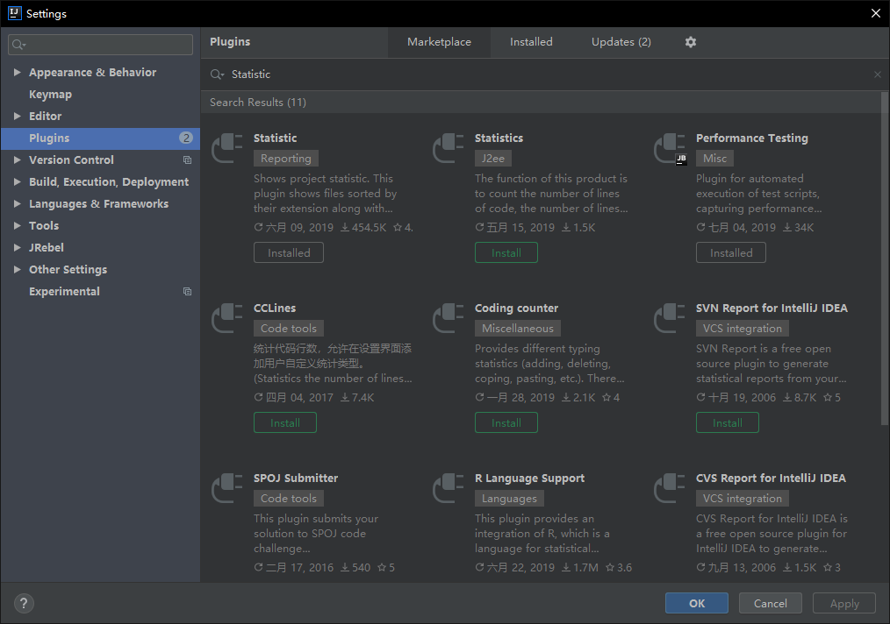
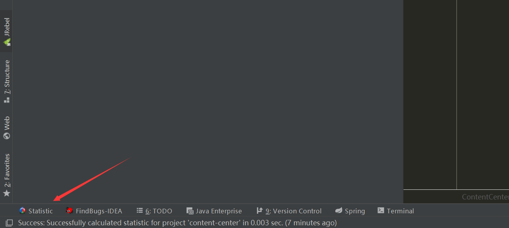
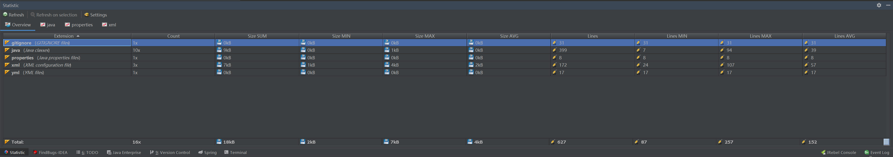
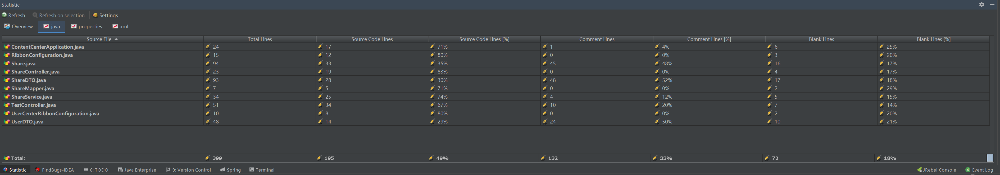

> 我们一个项目写下来，有时候需要统计一下代码项目代码的行数，或者想知道自己到底写了多少代码，可以使用IDEA插件Statistic扫描代码并统计结果。
- IDEA版本：2019.1.3
1. 安装插件
File->settings->plugins,点击"Marketplace"输入"Statistic"搜索

选择第一个安装
2. 重新启动IDEA，点击下面任务栏的Statistic标签

3. 点击"Refresh"扫描项目代码

- Overview 参数说明(例如java)
  - **Count** ： java文件的数量
  - **Size SUM** ： java所有文件总占用硬盘大小
  - **Size MIN** ： java文件的最小文件占用硬盘大小
  - **Size MAX** ： java文件的最大文件占用硬盘大小
  - **Size AVG** ： java文件的平均占用硬盘大小
  - **Lines** ： java文件的总行数
  - **Lines MIN** ： java文件的最小行数
  - **Lines MAX** ： java文件的最大行数
  - **Lines AVG** ： java文件的平均行数
  
  
- 指定文件类型(如java)统计参数说明
  - **Total Lines** ：代码总行数(包括注释，空行)
  - **Source Code Lines** ：源代码行数(不包括注释，空行)
  - **Source Code Lines(%)** ：源代码行数百分比(Source Code Lines/Total Lines)
  - **Comment Lines** ：注释行数
  - **Comment Lines(%)** ： 注释行数百分比(Comment Lines/Total Lines)
  - **Blank Lines** : 空行数
  - **Blank Lines(%)** : 空行百分比(Blank Lines/Total Lines)

> Refresh 统计该项目代码
> Refresh on selection 对你当前打开的代码进行统计。  
> Settings 里面可以排除一些文件夹，例如编译后的文件夹(前端),或者排除外部包和一个不需要统计的文件格式文件。

  